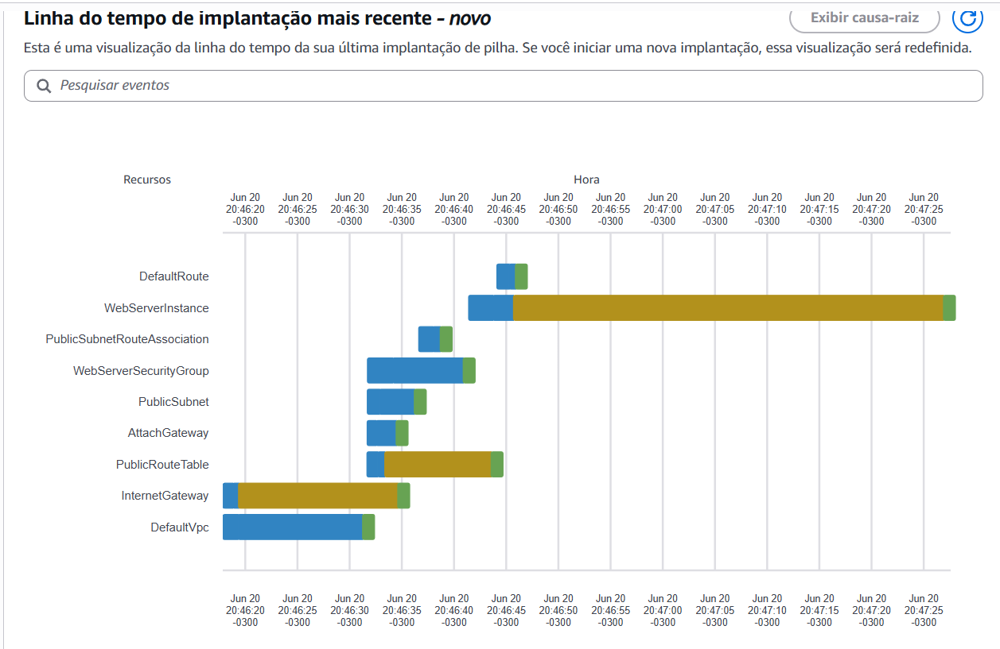
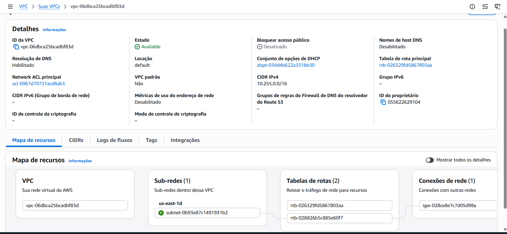

# 🚀 Desafio de Projeto AWS CloudFormation

Este repositório contém minha primeira stack criada com **AWS CloudFormation**, como parte do Bootcamp AWS.

O objetivo é praticar **Infraestrutura como Código (IaC)**, automatizando a criação de instâncias EC2, configuração de servidores web e regras de segurança.

---

## 🎯 Objetivos de Aprendizagem

- Aplicar conceitos de Infraestrutura como Código (IaC) em ambiente prático.
- Documentar processos técnicos de forma clara e estruturada.
- Utilizar GitHub para versionamento e compartilhamento de documentação técnica.

---

## 📂 Estrutura do Repositório

```text
aws-cloudformation-desafio/
│
├── README.md                # Documentação principal
├── templates/               # Templates CloudFormation
│   └── ec2-apache.yaml
├── notes/                   # Anotações e insights pessoais
│   └── insights.md
└── images/                  # Capturas de tela
    ├── stack-creation.png
    └── ec2-running.png
```

---

## ⚙️ Recursos Criados

- **VPC** com CIDR `10.255.0.0/16`
- **Subnet pública** com IP automático
- **Internet Gateway** e tabela de rotas
- **Security Group** permitindo:
  - SSH (porta 22)
  - HTTP (porta 80)
- **Instância EC2** com Amazon Linux 2023
- **Apache HTTP Server** instalado automaticamente via **UserData**

---

## 📜 Como Executar

### 1. Clone este repositório

```bash
git clone https://github.com/geibatistas/desafio-AWS-Cloud-Formation-DIO
cd aws-cloudformation-desafio/templates
```

### 2. Crie a stack utilizando a AWS CLI

```bash
aws cloudformation create-stack \
  --stack-name ApacheWebServerStack \
  --template-body file://ec2-apache.yaml \
  --parameters ParameterKey=KeyName,ParameterValue=<sua-chave-ssh>
```

### 3. Acompanhe a criação da stack

```bash
aws cloudformation describe-stacks \
  --stack-name ApacheWebServerStack
```

### 4. Acesse o servidor web

Após a criação da stack, utilize o **Public DNS** ou a URL disponibilizada nos **Outputs** para acessar a página web criada pelo Apache.

---

## 📸 Evidências

### Stack criada com sucesso



### Instância EC2 em execução com Apache



---

## 💡 Insights Pessoais

As anotações detalhadas estão disponíveis em:

```text
notes/insights.md
```

### Principais aprendizados

- A importância de parametrizar recursos para reutilização dos templates.
- Como o **UserData** simplifica a configuração inicial de servidores.
- A facilidade de replicar ambientes utilizando Infraestrutura como Código.
- Boas práticas como:
  - Versionar templates;
  - Documentar recursos;
  - Validar templates antes da implantação.

---

## 🔗 Referências

- Documentação AWS CloudFormation:
  https://docs.aws.amazon.com/cloudformation/

- Referência da AWS CLI:
  https://docs.aws.amazon.com/cli/

- Guia de Markdown do GitHub:
  https://docs.github.com/en/get-started/writing-on-github

---

## 👨‍💻 Autor

Projeto desenvolvido como parte do Bootcamp AWS para prática de Infraestrutura como Código (IaC) utilizando AWS CloudFormation.

**GitHub:** https://github.com/geibatistas
